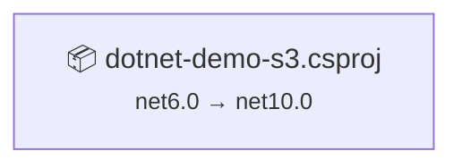

# .NET 10 Upgrade Plan

## Executive Summary

This plan details the upgrade of the dotnet-demo-s3 solution from .NET 6.0 to .NET 10.0. The solution consists of a single console application with 225 lines of code that provides S3 storage operations using the AWS SDK. The upgrade is classified as **Low Complexity** with minimal risk.

### Key Metrics
- **Total Projects**: 1
- **Target Framework**: .NET 10.0 (LTS)
- **Current Framework**: .NET 6.0
- **Total NuGet Packages**: 4 (2 require upgrades)
- **Lines of Code**: 225
- **Estimated Code Impact**: 0 lines (0.0%)
- **Upgrade Classification**: All-At-Once Strategy
- **Complexity**: 🟢 Low

### Upgrade Summary
The project requires only target framework update and two NuGet package upgrades. No breaking API changes were identified. The AWS SDK packages are already compatible with .NET 10.0.

---

## Upgrade Strategy

### Selected Approach: All-At-Once Strategy

**Rationale:**
- Single project solution (ideal for atomic upgrade)
- Already on modern .NET (6.0)
- Low complexity with only 225 LOC
- All dependencies have clear upgrade paths
- No breaking API changes identified
- Clean dependency graph with no inter-project dependencies

**Strategy Benefits:**
- Fastest completion time
- No multi-targeting complexity
- Simple validation and testing
- Single commit workflow
- Clean dependency resolution

**Execution Model:**
All changes will be applied in a single coordinated operation:
1. Update target framework to net10.0
2. Update Microsoft.Extensions.Configuration packages (6.0.x → 10.0.3)
3. Restore and build solution
4. Validate functionality

---

## Dependency Analysis

### Project Structure

The solution contains one self-contained console application with no project dependencies:



### Package Dependencies

| Package | Current | Target | Compatibility | Action |
|---------|---------|--------|---------------|--------|
| AWSSDK.S3 | 3.7.300.2 | 3.7.300.2 | ✅ Compatible | Keep |
| AWSSDK.Extensions.NETCore.Setup | 3.7.7 | 3.7.7 | ✅ Compatible | Keep |
| Microsoft.Extensions.Configuration | 6.0.1 | 10.0.3 | 🔄 Upgrade | Update |
| Microsoft.Extensions.Configuration.Json | 6.0.0 | 10.0.3 | 🔄 Upgrade | Update |

**Upgrade Order:** Single atomic update (all packages simultaneously)

**Dependency Notes:**
- AWS SDK packages are already .NET 10 compatible
- Microsoft.Extensions packages should be upgraded to align with target framework
- No transitive dependency conflicts expected

---

## Project-by-Project Upgrade Specifications

### dotnet-demo-s3.csproj

**Project Type:** SDK-style Console Application  
**Current Framework:** net6.0  
**Target Framework:** net10.0  
**Risk Level:** 🟢 Low  
**Dependencies:** None (standalone project)

#### Pre-Upgrade Status
- **SDK Style**: ✅ Already SDK-style (no conversion needed)
- **Target Framework**: net6.0
- **Package Count**: 4
- **Code Files**: 2 (Program.cs, S3Service.cs)
- **Lines of Code**: 225
- **API Issues**: 0 (no breaking changes detected)

#### Upgrade Steps

**1. Update Target Framework**

File: `dotnet-demo-s3.csproj`

Change line 5:
```xml
<!-- Before -->
<TargetFramework>net6.0</TargetFramework>

<!-- After -->
<TargetFramework>net10.0</TargetFramework>
```

**2. Update NuGet Package References**

File: `dotnet-demo-s3.csproj`

Update lines 14-15:
```xml
<!-- Before -->
<PackageReference Include="Microsoft.Extensions.Configuration" Version="6.0.1" />
<PackageReference Include="Microsoft.Extensions.Configuration.Json" Version="6.0.0" />

<!-- After -->
<PackageReference Include="Microsoft.Extensions.Configuration" Version="10.0.3" />
<PackageReference Include="Microsoft.Extensions.Configuration.Json" Version="10.0.3" />
```

Keep existing AWS SDK packages (no changes needed):
```xml
<PackageReference Include="AWSSDK.S3" Version="3.7.300.2" />
<PackageReference Include="AWSSDK.Extensions.NETCore.Setup" Version="3.7.7" />
```

**3. Restore Dependencies**

```bash
dotnet restore dotnet-demo-s3.csproj
```

**4. Build Project**

```bash
dotnet build dotnet-demo-s3.csproj --configuration Release
```

Expected: Build succeeds with zero errors and zero warnings.

**5. Validate Functionality**

Since this project has no unit tests, perform manual smoke testing:
- Run the application
- Test each menu option (1-6)
- Verify S3 operations work correctly:
  - Upload a text object
  - Download the object
  - Update the object
  - List objects
  - Delete the object

#### Code Changes Required

**None.** No code modifications are required. The API surface used in the project is fully compatible with .NET 10:
- AWS SDK APIs remain unchanged
- Console I/O operations are compatible
- Async/await patterns require no changes
- String operations are compatible
- LINQ operations (if any) are compatible

#### Breaking Changes Assessment

**No breaking changes impact this project.**

The assessment identified zero API compatibility issues:
- 🔴 Binary Incompatible: 0
- 🟡 Source Incompatible: 0
- 🔵 Behavioral Changes: 0

#### Post-Upgrade Validation

- [ ] Project builds without errors
- [ ] Project builds without warnings
- [ ] Application starts successfully
- [ ] S3 upload operation works
- [ ] S3 download operation works
- [ ] S3 update operation works
- [ ] S3 delete operation works
- [ ] S3 list operation works
- [ ] No runtime exceptions observed
- [ ] AWS SDK integration functions correctly

---

## Package Update Reference

### Summary Table

| Package Name | Projects | Current | Target | Change | Reason |
|--------------|----------|---------|--------|--------|--------|
| AWSSDK.Extensions.NETCore.Setup | dotnet-demo-s3 | 3.7.7 | 3.7.7 | None | Already compatible |
| AWSSDK.S3 | dotnet-demo-s3 | 3.7.300.2 | 3.7.300.2 | None | Already compatible |
| Microsoft.Extensions.Configuration | dotnet-demo-s3 | 6.0.1 | 10.0.3 | Upgrade | Framework alignment |
| Microsoft.Extensions.Configuration.Json | dotnet-demo-s3 | 6.0.0 | 10.0.3 | Upgrade | Framework alignment |

### Detailed Package Information

#### Microsoft.Extensions.Configuration

- **Change**: 6.0.1 → 10.0.3
- **Change Type**: Major version upgrade
- **Reason**: Align with .NET 10 target framework
- **Breaking Changes**: None affecting this project
- **Projects Affected**: dotnet-demo-s3.csproj

**Migration Notes:**
- Configuration APIs remain stable across versions
- No code changes required
- Improved performance and bug fixes in newer version

#### Microsoft.Extensions.Configuration.Json

- **Change**: 6.0.0 → 10.0.3
- **Change Type**: Major version upgrade  
- **Reason**: Align with .NET 10 target framework
- **Breaking Changes**: None affecting this project
- **Projects Affected**: dotnet-demo-s3.csproj

**Migration Notes:**
- JSON configuration APIs remain stable
- No code changes required
- Must match Microsoft.Extensions.Configuration version

---

## Breaking Changes Catalog

### Summary

**Total Breaking Changes**: 0

The assessment identified no breaking changes that affect this project. All APIs used in the codebase are fully compatible with .NET 10.0.

### Assessment Results

| Category | Count | Impact Level |
|----------|-------|--------------|
| 🔴 Binary Incompatible | 0 | None |
| 🟡 Source Incompatible | 0 | None |
| 🔵 Behavioral Changes | 0 | None |

### API Analysis

**Files Analyzed**: 2 (Program.cs, S3Service.cs)  
**APIs Analyzed**: 0 issues detected

The code uses:
- **AWS SDK APIs**: Stable across .NET versions
- **Console APIs**: No breaking changes
- **System.IO APIs**: Fully compatible
- **Async/Await**: No changes required
- **Collection Types**: Fully compatible

### Potential Runtime Behavioral Changes

While no breaking changes were detected, be aware of these general .NET 10 improvements:
- **Performance optimizations** in core libraries
- **Enhanced nullable reference type warnings** (already enabled in project)
- **Updated TLS/SSL defaults** for network operations

**Action Required**: None. These are improvements, not breaking changes.

---

## Testing Strategy

### Overview

Since the project has no automated tests, validation will rely on manual testing and build verification.

### Phase 1: Build Validation

**Objective**: Ensure the project compiles successfully after upgrade.

**Steps**:
1. Clean previous build artifacts: `dotnet clean`
2. Restore NuGet packages: `dotnet restore`
3. Build in Debug configuration: `dotnet build --configuration Debug`
4. Build in Release configuration: `dotnet build --configuration Release`

**Success Criteria**:
- ✅ Zero compilation errors
- ✅ Zero compilation warnings
- ✅ All dependencies restore successfully
- ✅ Output assembly generated correctly

### Phase 2: Functional Validation

**Objective**: Verify all S3 operations work correctly with .NET 10.

**Prerequisites**:
- AWS credentials configured (via environment variables, AWS CLI, or IAM role)
- S3 bucket accessible (update `bucketName` in Program.cs if needed)
- Network connectivity to AWS

**Test Scenarios**:

1. **Application Startup**
   - Launch application: `dotnet run`
   - Verify menu displays correctly
   - Confirm no initialization exceptions

2. **Upload Operation (Menu Option 1)**
   - Create a new text object
   - Verify success message appears
   - Confirm no exceptions

3. **List Operation (Menu Option 5)**
   - List objects without prefix
   - Verify uploaded object appears
   - Check object metadata (size, last modified)

4. **Download Operation (Menu Option 2)**
   - Download previously uploaded object
   - Verify content matches
   - Confirm success message

5. **Update Operation (Menu Option 3)**
   - Update existing object with new content
   - Verify success message
   - Download again to confirm update

6. **Delete Operation (Menu Option 4)**
   - Delete the test object
   - Verify success message
   - List objects to confirm deletion

7. **Error Handling**
   - Attempt to download non-existent object
   - Verify graceful error handling
   - Confirm application continues running

**Success Criteria**:
- ✅ All operations complete without exceptions
- ✅ AWS SDK integration functions correctly
- ✅ Error messages display appropriately
- ✅ Application remains responsive throughout

### Phase 3: Integration Validation

**Objective**: Verify the upgraded application works in deployment environment.

**Deployment Checks**:
- Application runs on target .NET 10 runtime
- AWS SDK can establish connections
- S3 operations work in production/staging environment
- Performance is acceptable (no regressions)

**Success Criteria**:
- ✅ Application deploys successfully
- ✅ No runtime compatibility issues
- ✅ AWS operations function correctly
- ✅ No performance degradation

### Testing Recommendations

Given the lack of automated tests, consider adding basic test coverage post-upgrade:

**High-Value Tests to Add**:
1. Unit tests for S3Service methods (using mocked IAmazonS3)
2. Integration tests for actual S3 operations (against test bucket)
3. Error handling tests for AWS exceptions

**Testing Framework Suggestions**:
- xUnit or NUnit for unit testing
- Moq for mocking IAmazonS3 interface
- FluentAssertions for readable assertions

---

## Risk Management

### Risk Assessment

**Overall Risk Level**: 🟢 Low

This upgrade presents minimal risk due to:
- Small, single-project solution
- Already on modern .NET (6.0)
- No breaking API changes identified
- Simple, well-defined functionality
- Stable AWS SDK dependencies

### Identified Risks

#### 1. AWS SDK Compatibility

**Risk**: AWS SDK behavior changes with .NET 10 runtime  
**Probability**: Low  
**Impact**: Medium  
**Mitigation**:
- AWS SDK versions 3.7.x are mature and stable
- Test all S3 operations after upgrade
- Monitor AWS SDK release notes for advisories

**Contingency**:
- Revert to .NET 6.0 if critical issues found
- Update to newer AWS SDK version if compatibility issues arise

#### 2. Configuration System Changes

**Risk**: Microsoft.Extensions.Configuration 10.0.3 introduces behavioral changes  
**Probability**: Very Low  
**Impact**: Low  
**Mitigation**:
- Configuration package APIs are stable
- Project doesn't use advanced configuration features
- Test application startup and configuration loading

**Contingency**:
- Configuration packages can be kept at 6.0.x if critical issues found
- .NET 10 is compatible with older Microsoft.Extensions packages

#### 3. Missing Test Coverage

**Risk**: Undetected regressions due to lack of automated tests  
**Probability**: Low  
**Impact**: Medium  
**Mitigation**:
- Perform comprehensive manual testing
- Document test scenarios clearly
- Test in non-production environment first

**Contingency**:
- Keep detailed test logs for comparison
- Have rollback plan ready
- Monitor application after deployment

#### 4. Deployment Environment Readiness

**Risk**: .NET 10 runtime not available in target environment  
**Probability**: Medium  
**Impact**: High  
**Mitigation**:
- Verify .NET 10 SDK/runtime installed before upgrade
- Check hosting environment compatibility
- Plan deployment window for runtime installation if needed

**Contingency**:
- Self-contained deployment option available
- Can delay upgrade until environment ready

### Risk Mitigation Strategy

**Pre-Upgrade**:
- ✅ Verify .NET 10 SDK installed locally
- ✅ Create upgrade branch (upgrade-to-NET10-1)
- ✅ Commit all pending changes to master
- ✅ Verify AWS credentials work in dev environment

**During Upgrade**:
- ✅ Follow steps sequentially (no parallelization needed)
- ✅ Verify build success before proceeding to testing
- ✅ Document any unexpected warnings or messages
- ✅ Commit changes atomically (single commit)

**Post-Upgrade**:
- ✅ Perform full manual testing before merge
- ✅ Monitor application for first 24-48 hours after deployment
- ✅ Keep .NET 6.0 version available for quick rollback
- ✅ Document any observations or issues

### Rollback Plan

**Rollback Triggers**:
- Build fails with unresolvable errors
- Critical runtime exceptions occur
- AWS SDK operations fail
- Performance degrades significantly

**Rollback Procedure**:

1. **Development Environment**:
   ```bash
   # Switch back to master branch
   git checkout master
   
   # Delete upgrade branch if needed
   git branch -D upgrade-to-NET10-1
   ```

2. **Project Restoration**:
   ```bash
   # Restore NuGet packages
   dotnet restore
   
   # Rebuild on .NET 6.0
   dotnet build
   ```

3. **Validation**:
   - Verify application works on .NET 6.0
   - Confirm AWS operations function
   - Document rollback reason

4. **Investigation**:
   - Analyze root cause of failure
   - Check for environmental factors
   - Review error logs and stack traces
   - Consult .NET 10 migration documentation

**Rollback Time Estimate**: < 5 minutes (development environment)

---

## Source Control

### Branch Strategy

**Source Branch**: `master`  
**Upgrade Branch**: `upgrade-to-NET10-1`  
**Merge Target**: `master`

### Commit Strategy

**Approach**: Single atomic commit for entire upgrade

**Rationale**:
- Single project with tightly coupled changes
- All-at-once strategy requires synchronized updates
- Easier to review and rollback as one unit
- Clean commit history

### Recommended Commit Structure

```
Upgrade dotnet-demo-s3 to .NET 10.0

- Update target framework from net6.0 to net10.0
- Upgrade Microsoft.Extensions.Configuration from 6.0.1 to 10.0.3
- Upgrade Microsoft.Extensions.Configuration.Json from 6.0.0 to 10.0.3
- Retain AWS SDK packages (already compatible)
- Build verified: zero errors, zero warnings
- Functionality tested: all S3 operations working

Assessment: 0 API breaking changes identified
Complexity: Low
Risk: Low

Co-authored-by: Copilot <223556219+Copilot@users.noreply.github.com>
```

### Pre-Commit Checklist

Before committing the upgrade:
- [ ] dotnet-demo-s3.csproj updated (target framework)
- [ ] NuGet package references updated
- [ ] `dotnet restore` completed successfully
- [ ] `dotnet build` completed with zero errors
- [ ] `dotnet build` completed with zero warnings
- [ ] Manual testing completed successfully
- [ ] All S3 operations verified working
- [ ] No unintended file changes included

### Merge Strategy

**Recommended**: Merge to master after successful testing

```bash
# From upgrade branch, after testing complete
git checkout master
git merge upgrade-to-NET10-1 --no-ff

# Push to remote
git push origin master
```

**Pull Request Review Points** (if using PR workflow):
- Target framework change in .csproj
- Package version updates
- Build output verification
- Test results documentation

---

## Complexity Assessment

### Overall Complexity: 🟢 Low

This upgrade is classified as low complexity based on multiple factors:

### Complexity Factors

| Factor | Rating | Justification |
|--------|--------|---------------|
| Solution Size | 🟢 Low | Single project, 225 LOC |
| Dependency Count | 🟢 Low | 4 packages, 2 need updates |
| Breaking Changes | 🟢 Low | 0 API issues identified |
| Framework Gap | 🟢 Low | .NET 6 → 10 (modern → modern) |
| Code Modifications | 🟢 Low | 0 code changes required |
| Test Coverage | 🟡 Medium | No automated tests (manual testing required) |
| Project Structure | 🟢 Low | SDK-style, no conversion needed |
| Third-Party Dependencies | 🟢 Low | AWS SDK is stable and compatible |

### Change Impact Analysis

**Project Files**: 1 file modified
- `dotnet-demo-s3.csproj`: 3 lines changed (target framework + 2 package versions)

**Code Files**: 0 files modified
- `Program.cs`: No changes
- `S3Service.cs`: No changes

**Configuration Files**: 0 files modified
- `appsettings.json`: No changes (no framework-specific settings)

**Total Lines Changed**: 3 (1.3% of project file)  
**Total Code Lines Changed**: 0 (0.0% of codebase)

### Effort Estimation

**Relative Complexity**: Low

The upgrade consists primarily of:
- 1 target framework property change
- 2 NuGet package version updates
- Standard build and test validation

**Skills Required**:
- Basic understanding of .NET project files
- Ability to run dotnet CLI commands
- Manual testing capability for S3 operations

**Dependencies**:
- .NET 10 SDK must be installed
- AWS credentials must be configured
- S3 bucket must be accessible

### Comparison Baseline

This upgrade is significantly simpler than:
- Multi-project solutions requiring dependency ordering
- .NET Framework → .NET Core migrations
- Projects with extensive breaking API changes
- Legacy projects requiring SDK-style conversion

---

## Success Criteria

### Technical Completion Criteria

The upgrade is considered technically complete when all of the following are true:

#### Build Success
- [ ] `dotnet clean` executes successfully
- [ ] `dotnet restore` completes without errors
- [ ] `dotnet build --configuration Debug` succeeds with zero errors
- [ ] `dotnet build --configuration Release` succeeds with zero errors
- [ ] No build warnings present
- [ ] Output assemblies target .NET 10.0

#### Project Configuration
- [ ] `dotnet-demo-s3.csproj` targets `net10.0`
- [ ] Microsoft.Extensions.Configuration upgraded to 10.0.3
- [ ] Microsoft.Extensions.Configuration.Json upgraded to 10.0.3
- [ ] AWSSDK.S3 version 3.7.300.2 retained
- [ ] AWSSDK.Extensions.NETCore.Setup version 3.7.7 retained
- [ ] No package dependency conflicts

#### Functional Validation
- [ ] Application starts without exceptions
- [ ] Menu system displays correctly
- [ ] Upload operation (option 1) works correctly
- [ ] Download operation (option 2) works correctly
- [ ] Update operation (option 3) works correctly
- [ ] Delete operation (option 4) works correctly
- [ ] List operation (option 5) works correctly
- [ ] Exit operation (option 6) works correctly
- [ ] Error handling functions appropriately

#### Code Quality
- [ ] No code changes required (API compatibility confirmed)
- [ ] All compiler warnings resolved
- [ ] No new runtime exceptions introduced
- [ ] Existing functionality preserved

#### Source Control
- [ ] Changes committed to upgrade-to-NET10-1 branch
- [ ] Commit message follows convention
- [ ] Only intended files modified (no accidental changes)
- [ ] Clean working directory after commit

### Operational Success Criteria

The upgrade is considered operationally successful when:

#### Deployment Readiness
- [ ] Application runs on .NET 10 runtime in target environment
- [ ] AWS SDK operations function in deployment environment
- [ ] Performance meets or exceeds .NET 6.0 baseline
- [ ] No environmental compatibility issues

#### Stability Indicators
- [ ] No crashes or exceptions in first 24 hours
- [ ] AWS S3 operations reliable and performant
- [ ] Error handling works as expected
- [ ] Application behavior matches pre-upgrade

#### Documentation Complete
- [ ] Upgrade steps documented
- [ ] Test results recorded
- [ ] Any deviations from plan noted
- [ ] Lessons learned captured

### Definition of Done

The upgrade is **DONE** when:

1. ✅ All Technical Completion Criteria met
2. ✅ All Functional Validation checks pass
3. ✅ Code merged to master branch
4. ✅ Application deployed to target environment (if applicable)
5. ✅ Operational monitoring shows stable behavior
6. ✅ Stakeholders notified of completion

### Acceptance Testing

**Manual Test Suite**: Execute the following test sequence:

```
Test Run: .NET 10 Upgrade Validation
Date: _______________
Tester: _____________

[ ] 1. Build Test
    - dotnet clean: PASS / FAIL
    - dotnet restore: PASS / FAIL
    - dotnet build (Debug): PASS / FAIL
    - dotnet build (Release): PASS / FAIL
    - Zero warnings: YES / NO

[ ] 2. Application Launch
    - dotnet run: PASS / FAIL
    - Menu displays: PASS / FAIL
    - No exceptions: PASS / FAIL

[ ] 3. Upload Test
    - Option 1 selected: PASS / FAIL
    - Object uploaded: PASS / FAIL
    - Success message: PASS / FAIL

[ ] 4. List Test
    - Option 5 selected: PASS / FAIL
    - Objects listed: PASS / FAIL
    - Uploaded object found: PASS / FAIL

[ ] 5. Download Test
    - Option 2 selected: PASS / FAIL
    - Content retrieved: PASS / FAIL
    - Content matches: PASS / FAIL

[ ] 6. Update Test
    - Option 3 selected: PASS / FAIL
    - Object updated: PASS / FAIL
    - Success message: PASS / FAIL

[ ] 7. Delete Test
    - Option 4 selected: PASS / FAIL
    - Object deleted: PASS / FAIL
    - Confirmed in list: PASS / FAIL

[ ] 8. Error Handling Test
    - Download non-existent: PASS / FAIL
    - Error message shown: PASS / FAIL
    - App still running: PASS / FAIL

[ ] 9. Exit Test
    - Option 6 selected: PASS / FAIL
    - Graceful shutdown: PASS / FAIL

Overall Result: PASS / FAIL
Notes: _________________________________
```

---

## Appendices

### A. Environment Requirements

**Development Environment**:
- .NET 10 SDK installed and configured
- Visual Studio 2022 (17.12+) or VS Code with C# extension
- Git for source control
- Terminal/PowerShell for CLI commands

**AWS Requirements**:
- AWS account with S3 access
- IAM credentials configured (AWS CLI, environment variables, or IAM role)
- S3 bucket created and accessible
- Network connectivity to AWS services

**Verification Commands**:
```bash
# Check .NET SDK version
dotnet --version  # Should show 10.0.x or higher

# List installed SDKs
dotnet --list-sdks  # Should include 10.0.x

# Verify AWS credentials
aws s3 ls  # Should list buckets (requires AWS CLI)
```

### B. Reference Documentation

**Official .NET Resources**:
- [.NET 10 Release Notes](https://github.com/dotnet/core/tree/main/release-notes/10.0)
- [Breaking Changes in .NET 10](https://learn.microsoft.com/en-us/dotnet/core/compatibility/10.0)
- [Migrate from .NET 6 to .NET 10](https://learn.microsoft.com/en-us/dotnet/core/porting/)

**AWS SDK Resources**:
- [AWS SDK for .NET Documentation](https://docs.aws.amazon.com/sdk-for-net/)
- [AWS SDK for .NET GitHub](https://github.com/aws/aws-sdk-net)
- [S3 API Reference](https://docs.aws.amazon.com/AmazonS3/latest/API/)

**Package Documentation**:
- [Microsoft.Extensions.Configuration](https://www.nuget.org/packages/Microsoft.Extensions.Configuration/10.0.3)
- [AWSSDK.S3](https://www.nuget.org/packages/AWSSDK.S3/)

### C. Troubleshooting Guide

**Build Errors**:

*Error*: "The current .NET SDK does not support targeting .NET 10.0"  
*Solution*: Install .NET 10 SDK from https://dot.net

*Error*: "Package restore failed"  
*Solution*: Clear NuGet cache (`dotnet nuget locals all --clear`) and retry

*Error*: "Package version conflict"  
*Solution*: Ensure both Microsoft.Extensions packages use same version (10.0.3)

**Runtime Errors**:

*Error*: AWS access denied exceptions  
*Solution*: Verify AWS credentials, IAM permissions, and bucket access

*Error*: "Unable to find bucket"  
*Solution*: Update `bucketName` in Program.cs to valid S3 bucket name

*Error*: Network timeout on S3 operations  
*Solution*: Check network connectivity, AWS region configuration, and firewall rules

**Performance Issues**:

*Issue*: Slower S3 operations  
*Investigation*: Compare with .NET 6.0 baseline, check network latency, review AWS SDK diagnostics

*Issue*: Increased memory usage  
*Investigation*: Profile application with dotnet-trace, compare with baseline

### D. Post-Upgrade Optimization Opportunities

Once the upgrade is complete and stable, consider these improvements:

**Testing Enhancements**:
- Add xUnit test project for S3Service unit tests
- Implement integration tests for S3 operations
- Add code coverage measurement

**Code Quality**:
- Enable more nullable reference type checks
- Add XML documentation comments
- Consider using async Main() pattern

**Configuration**:
- Move bucket name and region to appsettings.json
- Add configuration validation on startup
- Support multiple AWS profiles

**AWS SDK Optimization**:
- Implement retry policies for transient failures
- Add CloudWatch logging integration
- Consider using AWS SDK service clients with dependency injection

**Performance**:
- Profile S3 operation performance
- Consider S3 Transfer Acceleration for large files
- Implement connection pooling optimization

---

*This upgrade plan was generated based on automated assessment findings. Review and adjust as needed for your specific environment and requirements.*

**Plan Version**: 1.0  
**Target Framework**: .NET 10.0 (LTS)  
**Assessment Date**: 2026-03-05  
**Plan Classification**: All-At-Once Strategy  
**Overall Complexity**: 🟢 Low  
**Overall Risk**: 🟢 Low
